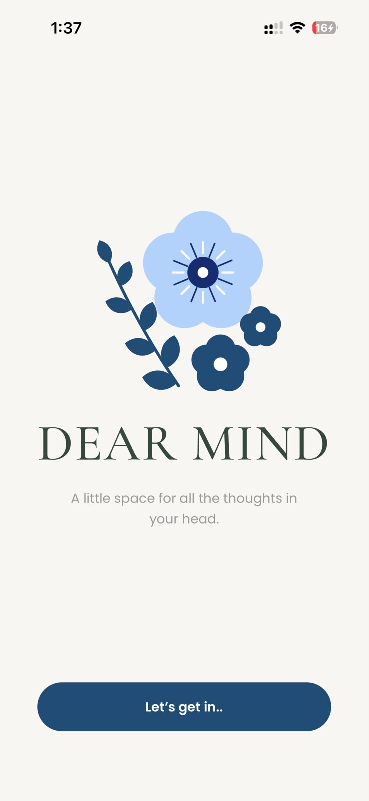
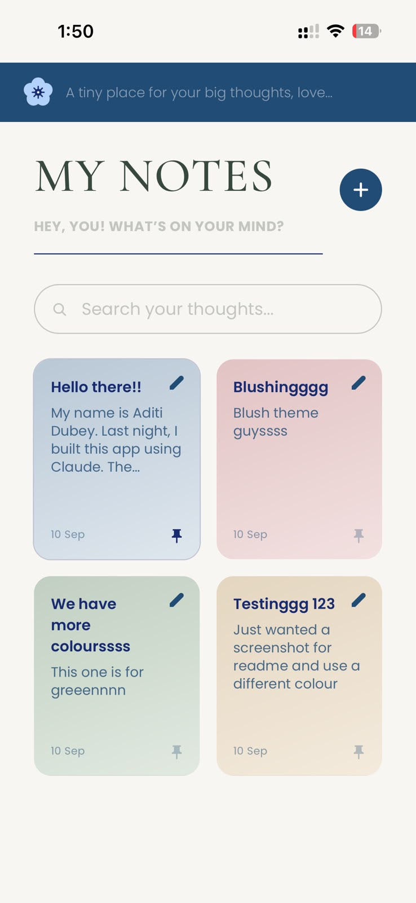
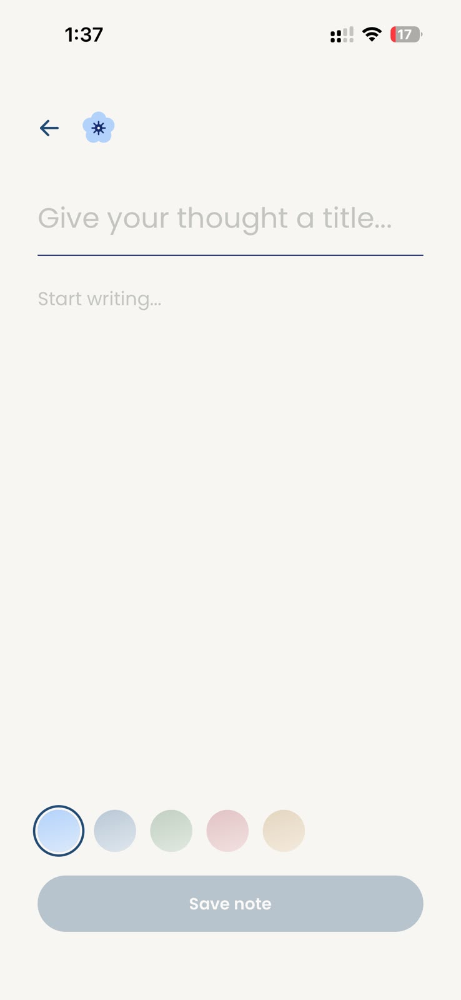
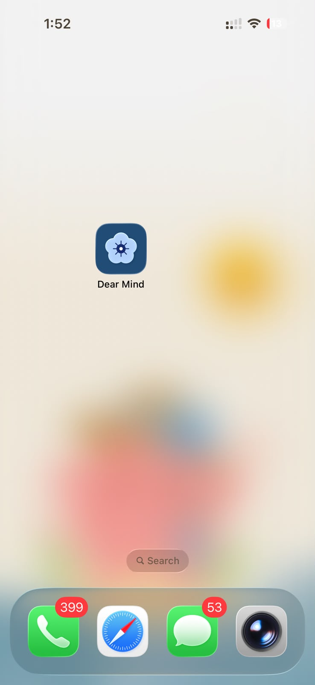
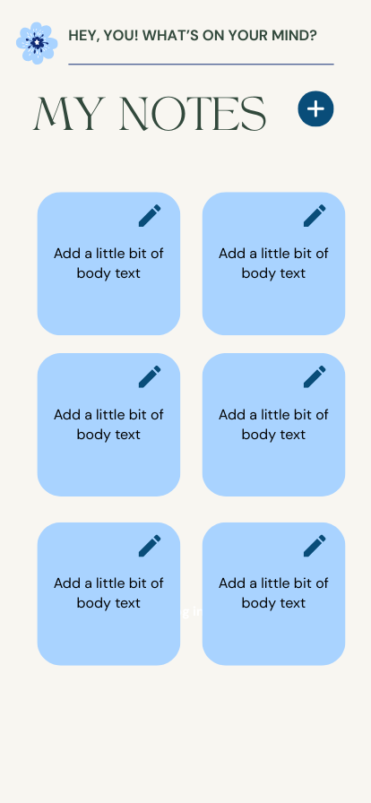
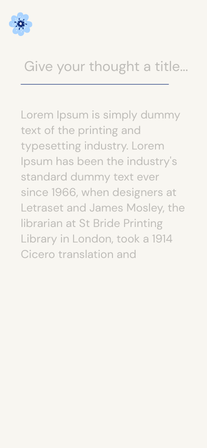

# Dear Mind 🌸

**A tiny place for your big thoughts.**

A cosy, mobile-first notes app that installs on your phone and works with no
internet at all. No backend, no accounts, no tracking — your notes never leave
your device.

**[→ Try it live](https://adt-dear-mind.vercel.app)** · Open it on a phone and
add it to your home screen.

<p align="center">
  
  
  
  
</p>

<p align="center"><em>Running on iOS, installed to the home screen — no browser chrome.</em></p>

---

## What it does

- **Write, edit and delete notes** — a full-screen editor, no clutter
- **Search** across every title and body as you type
- **Pin** the notes that matter to the top
- **Five colours**, each a gradient built from the app's own palette
- **Works offline.** Not "degrades gracefully" — genuinely opens and runs in
  airplane mode
- **Installs like an app.** Home screen icon, no address bar, full screen
- **Remembers everything** in `localStorage`, per device

## Why it's built this way

The whole app is one page with no server, no database and no auth. That's a
deliberate constraint, not a shortcut: a notes app you'd actually use on your
phone should open instantly and work on the underground. Every piece of
infrastructure you add is another thing that can be slow or unavailable.

The tradeoff is honest and stated up front — **there's no sync**. Notes on your
phone are not the notes on your laptop, because `localStorage` is per-device.
That's the cost of owning no server, and for a personal notebook it's a fair one.

## Built with

| | |
|---|---|
| **React 19** + **TypeScript** | UI, with types across every data boundary |
| **Vite 6** | Dev server and build |
| **Tailwind CSS v4** | Styling, with the palette as CSS-first design tokens |
| **vite-plugin-pwa** (Workbox) | Service worker and app manifest |
| **localStorage** | The entire persistence layer |

No state library, no router, no component library, no icon package. At this
size they'd each cost more than they'd save — the icons are inline SVG and the
"routing" is one union type.

## How it's organised

```
src/
├── App.tsx              State, CRUD, and the home screen
├── types.ts             Note, NoteColor, NoteDraft
├── index.css            Design tokens — the palette lives here
├── lib/
│   ├── storage.ts       localStorage read/write, validation, migration
│   ├── colors.ts        The five note gradients
│   └── date.ts          Relative and short date formatting
└── components/
    ├── NoteCard.tsx     One note in the grid
    ├── NoteEditor.tsx   Full-screen write/edit view
    ├── SearchField.tsx  Search input
    ├── Welcome.tsx      First-launch screen
    ├── Flower.tsx       The logo mark
    └── FloralMark.tsx   The welcome arrangement
```

All the state lives in `App`. Components below it receive props and report back
through callbacks — `NoteEditor` has no idea `localStorage` exists, which is
exactly why swapping in a cloud backend later wouldn't touch it.

## Details worth a look

**Storage is validated, not trusted.**
[`lib/storage.ts`](src/lib/storage.ts) treats everything coming out of
`localStorage` as hostile — it's text a user can hand-edit, and `JSON.parse`
will happily return nonsense that only explodes later, mid-render. A type
guard checks every entry and drops the bad ones. Both reads and writes are
wrapped in `try/catch`, because Safari in private mode *throws* the moment you
touch `localStorage`.

**Old notes survive new features.**
`color` and `pinned` were added after notes had already been saved. Rather than
discarding notes that predate them, `toNote()` fills in defaults on the way in —
so a note written before colours existed simply becomes a Sky note. That's why
the storage key is still `v1`: nothing was lost, so nothing needed migrating
away.

**The palette is one block of CSS.**
Every colour is a token in [`index.css`](src/index.css). Tailwind v4 turns each
into both a utility class (`bg-navy`) and a real CSS variable, and the SVG
illustrations reference the variables directly — so re-skinning the entire app,
flowers included, means editing eight lines.

**The illustrations are computed, not drawn.**
[`FloralMark.tsx`](src/components/FloralMark.tsx) defines the stem as a cubic
Bézier curve, then derives every leaf's position *and* angle from that curve
using its derivative. Move a control point and the leaves follow it
automatically — they can't drift off the stem, because they have no coordinates
of their own. About 1KB, sharp at any size.

**Impossible states can't be written down.**
Both the editor mode and the confirmation dialogs are single union types rather
than several booleans, so "open with no note" or "confirming a delete and a
discard at once" aren't states the code can express.

**Back doesn't lose your work.**
The editor tracks whether anything actually changed, and both the on-screen
arrow and Android's hardware back button route through the same check. The
hardware button works because the editor pushes a history entry when it opens —
without one, a single-page app has nothing to go "back" to and the OS would
just close it.

**Caching is split by filename.**
Assets under `/assets/` carry a content hash, so [`vercel.json`](vercel.json)
caches them for a year. `sw.js` keeps a stable filename while its contents
change, so it's set to never cache — get that backwards and users are pinned
to an old build with no way out.

**Fonts ship with the app.** A `<link>` to Google Fonts is a network request,
and offline means no network. Cormorant Garamond and Poppins are bundled
(Latin subset only) and precached, so the typography survives airplane mode.

## Running it locally

```bash
git clone https://github.com/Dubey-aditi/dear-mind.git
cd dear-mind
npm install
npm run dev          # http://localhost:5173
```

To test the PWA — install prompt, offline mode — you need the production build,
because the service worker isn't active in dev:

```bash
npm run build
npm run preview      # http://localhost:4173
```

Then in DevTools: **Application → Service Workers** to confirm it registered,
and **Network → Offline** to prove it runs without a connection.

> Service workers only run over HTTPS or on `localhost`. Opening the dev server
> from your phone over `http://192.168.x.x` will load the app but won't install
> it or cache anything.

Built size: **~75 KB gzipped** of JavaScript, 375 KB precached including all
fonts and icons.

## Deliberately not included

Scoped out of v1 to keep it small and finishable:

- Accounts and authentication
- Cloud sync between devices
- Rich text or Markdown
- Image attachments
- Note sharing

The architecture leaves room for them — persistence sits behind two functions
in `lib/storage.ts`, so a networked backend would slot in there without the
components noticing.

## Design

The app was designed in Canva first, then rebuilt in React. Colours were
sampled directly out of the original artwork rather than eyeballed, and the
flowers were redrawn as SVG so they stay sharp at any size and need no network.

<p align="center">
  
  
  
</p>

<p align="center"><em>The original Canva references.</em></p>

## Licence

MIT — see [LICENSE](LICENSE).
